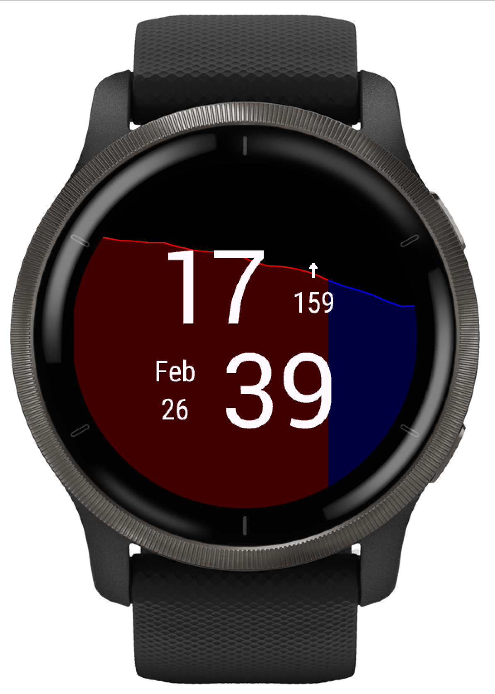

# WatchYourSugar

## Disclaimer
**Never make a medical decision based on a reading that you see on this app, such as your watch. Always perform a fingerstick blood glucose check first.**

## Watchface Description
Introducing **WatchYourSugar** – a visually pleasing watchface designed to prioritize aesthetics while seamlessly providing essential information about your blood sugar levels. Beyond displaying the standard time and date, WatchYourSugar prominently features your current blood sugar information sourced from the xDrip app on your phone.

The watchface goes a step further by presenting additional details such as the current trend of your blood sugar levels and a subtle plot in the background, giving you a quick glance at your recent history.

## Functionality
To ensure proper functioning, make sure to enable the xDrip Web-Server in your xDrip+ app (*Settings -> Inter-App Settings -> enable "xDrip Web-Server," but not the "Open Web Server"*).

## Open Source
WatchYourSugar operates under the GPL v3 license, emphasizing transparency and community collaboration. The source code is available on [GitHub](https://github.com/IllyaByelkin/WatchYourSugar).

## Early Phase and Bug Reporting
As WatchYourSugar is in its early development phase, your feedback is crucial. If you encounter any bugs or have suggestions for improvement, please share your insights with me.

## Participate in Watchface Creation
If you're interested in contributing to the evolution of WatchYourSugar, here are some TODOs for consideration:
- Expand compatibility by incorporating other data sources like Spike or Nightscout.
- Extend support to other watch models, such as the Instinct series or watches with square displays.
- Enhance the visual appeal by updating the font for the trend arrows.
- Share any creative ideas that could enhance the overall user experience.

Your participation and input are highly valued in shaping WatchYourSugar into a versatile and user-friendly watchface for the community.

